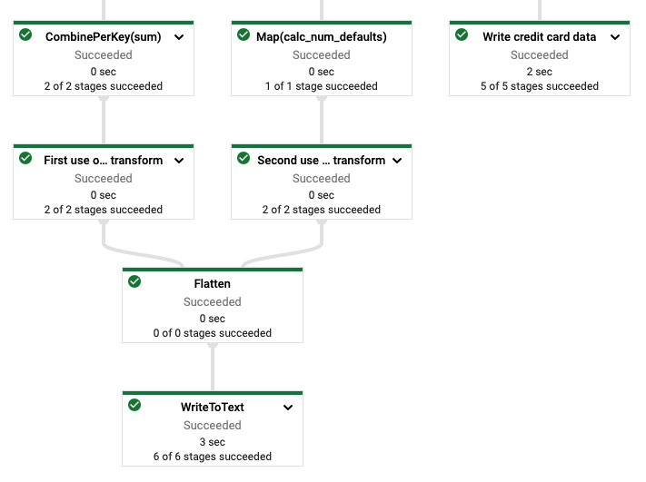

# Runnign Batch Apache Beam pipeline on GCP's Dataflow

## Description:

### Credit card skippers/defaulters:

- Assign 1 point to customer for short payment, where a short payment means when customer fails to clear at least 70% of its monthly spends.

- Assign 1 point to customer where he has spent 100% of his max_limit but did not clear the full amount.

- If for any month customer is meeting both the above conditions, assign 1 additional point.

- Sum up all the points for a customer and output in file top-10 card skippers.

### Loan Defaulters:

- For Personal loan category, Bank does not accept short or late payments. If a person has not paid monthly installment then that month's entry won't be present in the file.

- For Medical loan, Bank does accepts late payments but it should be the full amount. It is assumed that there is every month's data/record for Medical Loan.

- Medical Loan defaulters : If customer has made a total of 3 or more late payments.

- Personal Loan defaulters : If customer has missed a total of 4 or more installments OR missed 2 consecutive installments.

#### Steps to reproduce:

1. Create virtual environment with the following dependencies:
    - `pip install google-cloud-pubsub`
    - `pip install 'apache-beam[gcp]'`
    - `pip install google-apitools`
    
2. Create GCP account and service account with owner role. Then generate key credentials file in the format of json file.
   
3. Set the GOOGLE_APPLICATION_CREDENTIALS environmental variable in your venv with the following command:

   `set GOOGLE_APPLICATION_CREDENTIALS=path_to_credentials.json`

4. Run the following command to set acces to GCP resources (it requires installation and activation of `gcloud` CLI tool):

   `cloud auth application-default login`

5. Enable Dataflow API

6. Create 2 GCS buckets. One for Dataflow job's temporary files (required by Dataflow) and second for input files and output results.

7. Upload `cards.txt` and `loan.txt` to the bucket.

8. Run the following command:

   `python3 process.py --input1 gs://demo-files1/cards.txt --input2 gs://demo-files1/loan.txt  --output2 gs://demo-files1/loan_result/part  --output1 gs://demo-files1/card_results/part --runner DataflowRunner --project apache-beam-tutorial-336022 --temp_location gs://demo-temp1/tmp --region us-central1`

