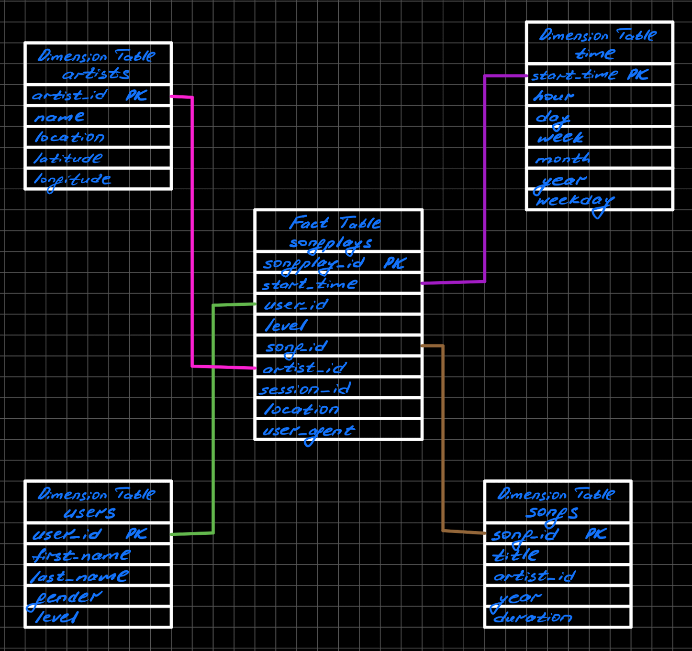

# Cloud DWH

## Question:

What is the purpose of this database in the context of the startup, Sparkify, and their analytical goals?

## Answer:

Metrics help startups set goals. Without metrics, it would be next to impossible to set goals and measure company's progress towards them. Metrics also help entrepreneurs make smart, informed decisions about their startups. They can identify trends and patterns, problem areas and successes, and potential next steps.

The Sparkify's analytics team is particularly interested in understanding what songs users are listening to. The immediate question that pops up here is why do they need this information? Let's suggest that the ultimate goal is to keep the user listening music in their app for as long as possible. From here it becomes clear that they might need some form of the recommender system that will be able to find user's preferences and based on some similarity calculations to other users make a predictions of what user will like. These personalized recommendations hopefully will keep the user listening music in their streaming app and increase the average time of using this app for day/week/month.

By utilizing star schema, we were able to model our data in a denormalized way, which helps simplify queries and make fast aggregations for analysis.

## Question:

State and justify your database schema design and ETL pipeline.

## Answer:

The choice of the **Star Schema** can be explained by the fact that we need the *OLAP* database for complex analytical and ad-hoc quieries. This denormalized approach improves the read performance as we won't need to perform so much JOIN operations, which are slow. Of course this all comes at the expense of *Data Integrity*.

ETL pipeline is pretty straightforward: after impersonating our Redshift Cluster, created via Python SDK (boto3), by IAM role with ReadOnlyAccess we were able to point it to S3 bucket. From there we've copied our log and song data from there into the staging area (staging_events and staging_songs) using COPY command. After that we run multiple INSERT commands on 5 tables that represent our star schema. Most of them are pretty simple and only `songplays` table required JOIN of both our staging tables.

## How to run python scripts:

Before running the `etl.py` file we should always run `create_tables.py` script, which drops all the tables from our Redshift Cluster and creates the necessary tables based on the list of queries in the `sql_queries.py` file. 

## File explanations:

`sql_queries.py` contains queries for dropping and creating from scratch fact table *songplays* and dimensional tables: *users, songs, artists, time*. Also it contains COPY commands, that copy all our log and song data from S3 bucket to staging area tables inside of our Redshift Cluster.

`create_tables.py` connects to our Redshift Cluster and resets all our tables. We should always run it before `etl.py`.

`etl.py` uses COPY and INSERT queries to upload our data from S3 bucket to staging area and then into the dimensional model, that can be later used for analytical queries.

`Cluster_Creation.ipynb` contains code for creating Redshift Cluster and impersonating it with IAM role and also deleting them.

## Database Schema

