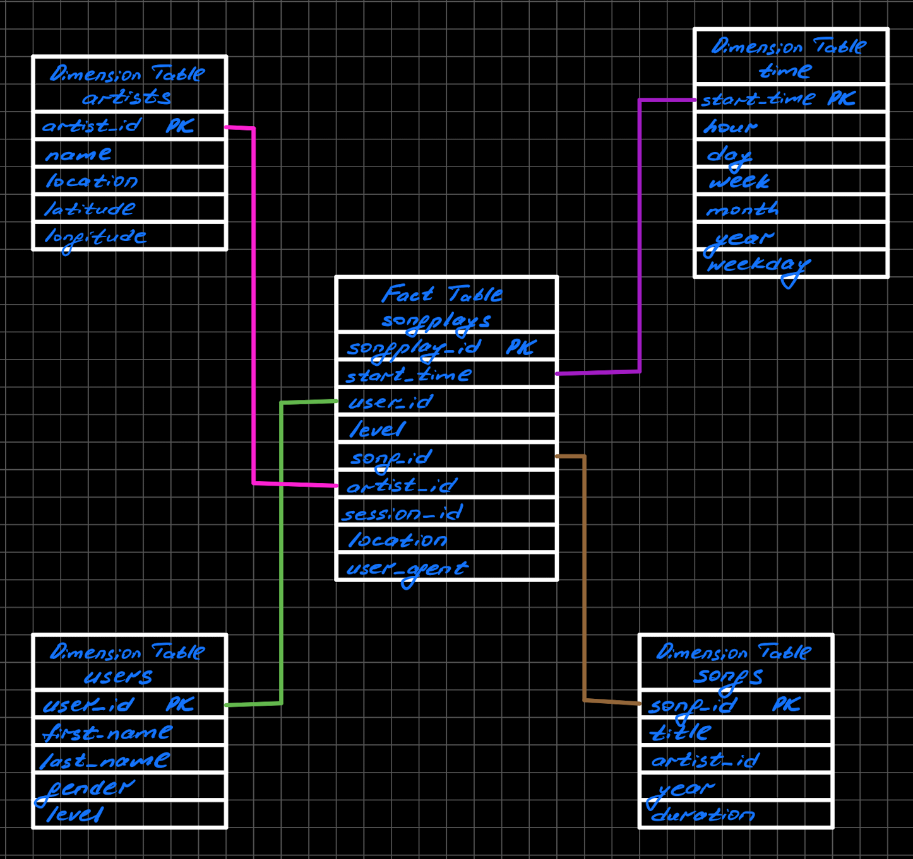

# Data Lake project

## Question:

What is the purpose of this database in the context of the startup, Sparkify, and their analytical goals?

## Answer:

Metrics help startups set goals. Without metrics, it would be next to impossible to set goals and measure company's progress towards them. Metrics also help entrepreneurs make smart, informed decisions about their startups. They can identify trends and patterns, problem areas and successes, and potential next steps.

The Sparkify's analytics team is particularly interested in understanding what songs users are listening to. The immediate question that pops up here is why do they need this information? Let's suggest that the ultimate goal is to keep the user listening music in their app for as long as possible. From here it becomes clear that they might need some form of the recommender system that will be able to find user's preferences and based on some similarity calculations to other users make a predictions of what user will like. These personalized recommendations hopefully will keep the user listening music in their streaming app and increase the average time of using this app for day/week/month.

By utilizing star schema, we were able to model our data in a denormalized way, which helps simplify queries and make fast aggregations for analysis.

## Question:

State and justify your database schema design and ETL pipeline.

## Answer:

The choice of the **Star Schema** can be explained by the fact that we need the *OLAP* database for complex analytical and ad-hoc quieries. This denormalized approach improves the read performance as we won't need to perform so much JOIN operations, which are slow. Of course this all comes at the expense of *Data Integrity*.

## File explanation

In our main script called etl.py we at first parsing our config file containing key access pair to set our 
environmental variable. After we define three functions. 

The first one `create_spark_session` is the simples, which creates spark session and returns it. 

The second `process_song_data` loads all the json files from song_data folder, that resides in the S3 bucket, which are partitioned by first three letters in the name of the file (that's why we use star notation). Eventually this way we stacking the content of these files into a single dataframe, create `artists` and `songs` dataframes from it and saving them into parquet file for storing in a highly commpressed way.

The last one is `process_log_data`, which does the similar thing comparing to the second function. It loads log data from another folder that as well stores json files partitioned by year and month. Extracts needed information to create user table and time table. For hte last one we use useer defined functions in Spark. Here we again loads all the data from the song_data folder to join this data with log data to get the main songplays_table.

## How to run python scripts:

`etl.py` can be run simply in the project workspace. But before running it we should make sure, that all the folder with parquet files are deleted. It also can be run on EMR cluster, but in this case there is no need to store key access pairs. The same goes if we want to run in in the jupyter notebook attached to our cluster.

## Database Schema

