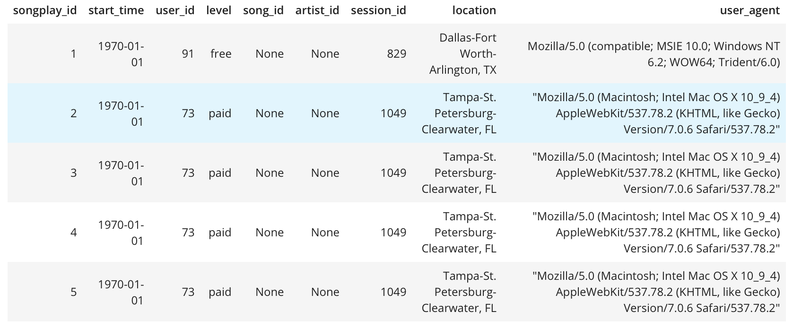
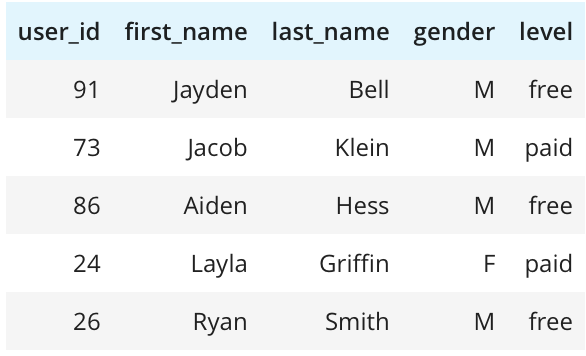
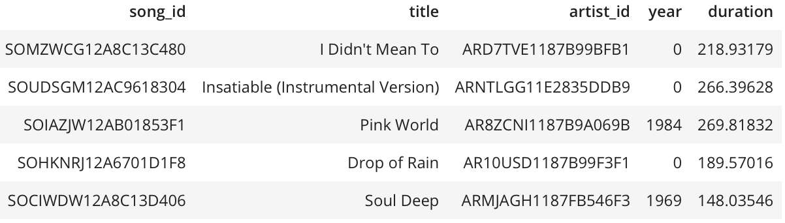
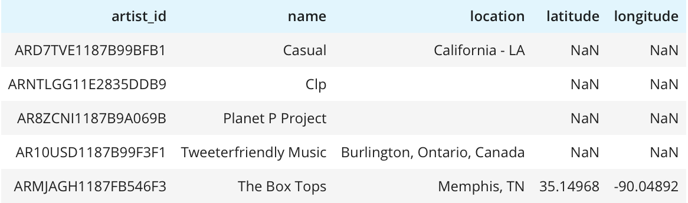
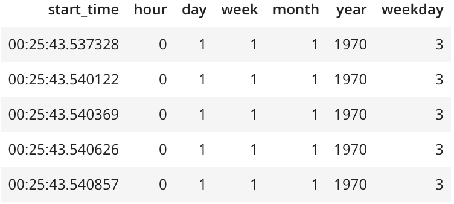

# Data Modeling with Postgres

## Question:

What is the purpose of this database in the context of the startup, Sparkify, and their analytical goals?

## Answer:

Metrics help startups set goals. Without metrics, it would be next to impossible to set goals and measure company's progress towards them. Metrics also help entrepreneurs make smart, informed decisions about their startups. They can identify trends and patterns, problem areas and successes, and potential next steps.

The Sparkify's analytics team is particularly interested in understanding what songs users are listening to. The immediate question that pops up here is why do they need this information? Let's suggest that the ultimate goal is to keep the user listening music in their app for as long as possible. From here it becomes clear that they might need some form of the recommender system that will be able to find user's preferences and based on some similarity calculations to other users make a predictions of what user will like. These personalized recommendations hopefully will keep the user listening music in their streaming app and increase the average time of using this app for day/week/month.

By utilizing star schema, we were able to model our data in a denormalized way, which helps simplify queries and make fast aggregations for analysis.

## Question:

State and justify your database schema design and ETL pipeline.

## Answer:

The choice of the **Star Schema** can be explained by the fact that we need the *OLAP* database for complex analytical and ad-hoc quieries. This denormalized approach improves the read performance as we won't need to perform so much JOIN operations, which are slow. Of course this all comes at the expense of *Data Integrity*.

ETL pipeline is pretty straightforward: we read one .json file at a time from 2 directories and parse it into the pandas' DataFrame. From there we simply extract needed information for our fact and dimension tables by running simple INSERT statements.

## How to run python scripts:

Before running the `etl.py` file we should always run `create_tables.py` script, which drops the *sparkifydb* database, creates it from scratch, drops all the tables from it and creates the necessary tables based on the list of queries in the `sql_queries.py` file. 

## File explanations:

`sql_queries.py` contains code for dropping fact table *songplays* and dimension tables: *users, songs, artists, time*. Also it has logic for making a single row insert into each one of those tables with handling the problem of duplicates in the primary keys. 

`create_tables.py` contains all the necessary steps for reseting our *sparkifydb* database before each run of the `etl.py`.

`etl.py` contains `process_song_file` function, that extracts data from the .json file in the song_data directory and inserts it into artists and songs tables. We also have `process_log_file` function to do the similar task for the remaining tables. `process_data` function loops over all of the files in the given directory and applies the one of the functions described above. In the `main` function we put all of them into work.

`test.ipynb` runs a set of quieries to check if our tables contain the correct data.

`etl.ipynb` has logic for making ETLs for each table on just a single file.

## Database Schema

## Expected results of the `test.ipynb` after running `etl.py`

1. `%sql SELECT * FROM songplays LIMIT 5;`

2. `%sql SELECT * FROM users LIMIT 5;`

3. `%sql SELECT * FROM songs LIMIT 5;`

4. `%sql SELECT * FROM artists LIMIT 5;`

5. `%sql SELECT * FROM time LIMIT 5;`

