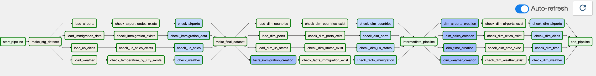
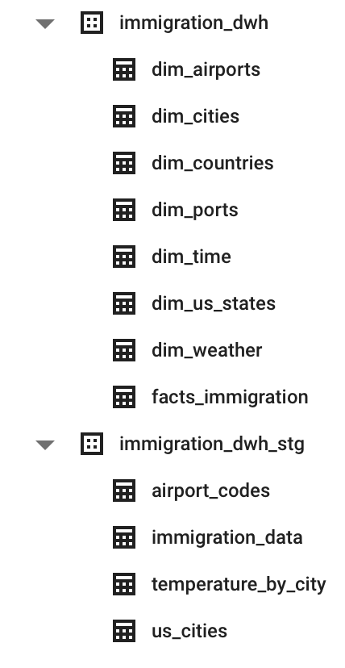
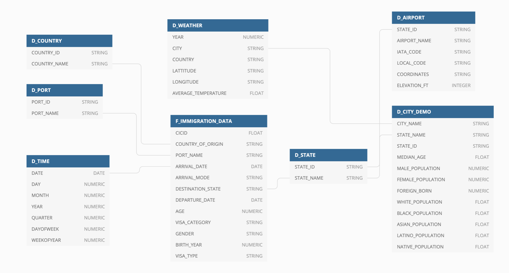
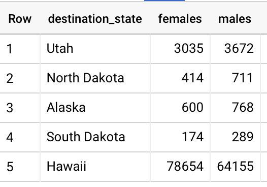
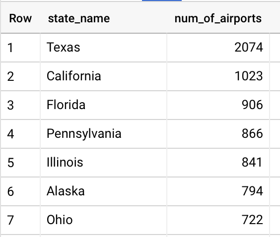
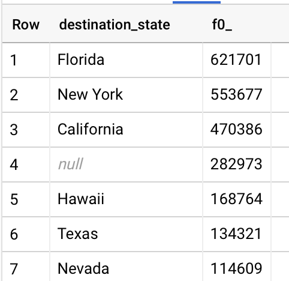

# Data Lake and DWH on GCP

## Project description

In this project we create Data Lake using **Google Cloud Storage** to store our raw data
and orchestrating our transformations with Google's fully-managed Airflow environment
called **Cloud Composer** that helps us to create all necessary staging and final facts
and dimensional models in **BigQuery** for analytical workloads. The DWH is built 
around the I94 Immigration data provided by the US government. The data warehouse will
help US official to analyze immigration patterns to understand what factors drive 
people to move.

## Data Description

Data Set | Format | Description |
--- | --- | --- |
[I94 Immigration Data](https://www.trade.gov/national-travel-and-tourism-office) | Parquet | Data contains international visitor arrival statistics by world regions and select countries (including top 20), type of visa, mode of transportation, age groups, states visited (first intended address only), and the top ports of entry. (Provided by Udacity) |
[US City Demographic Data](https://public.opendatasoft.com/explore/dataset/us-cities-demographics/export/) | CSV | This dataset contains information about the demographics of all US cities and census-designated places with a population greater or equal to 65,000. |
[World Temperature Data](https://www.kaggle.com/berkeleyearth/climate-change-earth-surface-temperature-data) | CSV | This dataset is from Kaggle and contains monthly average temperature data at different country in the world wide. |
[Airport Codes](./airports/.airport-codes_csv.csv) | CSV | All the Airport Codes and their corresponding full names. (Can be found in the project directory) |
[Ports](./ports_states_countries/ports.csv) | CSV | All the Port Codes and their corresponding full names. (Can be found in the project directory) |
[Countries](./ports_states_countries/countries.csv) | CSV | All the Country Codes and their corresponding full names. (Can be found in the project directory) |
[US States](./ports_states_countries/us_states.csv) | CSV | All the US State Codes and their corresponding full names. (Can be found in the project directory) |

## Steps to reproduce the project

1. Copy all the mentioned above data into GCS with the following structure:

        [cloud_storage_bucket_name]/airports/airport-codes_csv.csv
        [cloud_storage_bucket_name]/airports/airport_codes_schema.json
        
        [cloud_storage_bucket_name]/cities/aus-cities-demographics.csv
        [cloud_storage_bucket_name]/cities/us_cities_schema.json
        
        [cloud_storage_bucket_name]/ports_countries_states/ports.csv
        [cloud_storage_bucket_name]/ports_countries_states/countries.csv
        [cloud_storage_bucket_name]/ports_countries_states/us_states.csv
        
        [cloud_storage_bucket_name]/immigration_data/*.parquet

2. Put the name of your GCS bucket and project id to the corresponding variables in config_vars.py file.

3. Create Cloud Composer Environment in the same region and zone as your GCS bucket. In the image dropdown choose Airflow 2 or higher and Python version 3. Cloud Composer creates environment for about 25 minutes.

4. After Cloud Composer environment is ready, you'll see an additional GCS bucket with the similar name as the name of your environment. Put `config_vars.py`, `sql_queries.py` and `dag.py` into the DAG folder. As soon as these files hit the bucket the Composer starts to execute your DAG.

5. Monitor DAG execution in the provided by Cloud Composer Airflow UI.

## Complete DAG in the Airflow UI



## Resulting structure of the staging and final tables



## Resulting Snowflake schema




## Query Examples
**1. Let's find out if states with more male population than female actually have more male arriving immigrants.**
```
WITH female_result AS (
    SELECT 
        destination_state,
        COUNT(*) females
    FROM 
        `bigquery-demo-325614.immigration_dwh.facts_immigration` 
    WHERE destination_state IN (
        SELECT 
        state_name
    FROM (
        SELECT 
            state_name,
            CAST(SUM(male_population) AS INT64) AS male_population,
            CAST(SUM(female_population) AS INT64) AS female_population
        FROM 
            `bigquery-demo-325614.immigration_dwh.dim_cities`
        GROUP BY 1)
        WHERE female_population < male_population
    ) AND gender = 'FEMALE'
    GROUP BY destination_state
),

male_result AS (
    SELECT 
        destination_state,
        COUNT(*) males
    FROM 
        `bigquery-demo-325614.immigration_dwh.facts_immigration` 
    WHERE destination_state IN (
        SELECT 
        state_name
    FROM (
        SELECT 
            state_name,
            CAST(SUM(male_population) AS INT64) AS male_population,
            CAST(SUM(female_population) AS INT64) AS female_population
        FROM 
            `bigquery-demo-325614.immigration_dwh.dim_cities`
        GROUP BY 1)
        WHERE female_population < male_population
    ) AND gender = 'MALE'
    GROUP BY destination_state
)

SELECT 
    *
FROM 
    female_result 
INNER JOIN male_result USING(destination_state)
```

### Result



In top 5 US states, where male population is greater that female, mostly all of them have more male immigrants, except for Hawaii.
That's interesting, because male population of this state is higher than female, but the difference in number of arriving immigrants between male and female is profound.

**2. Let's find out whether states with the highest number of airports receive most of the immigrants.**
```
SELECT 
    destination_state,
    COUNT(DISTINCT cicid) 
FROM 
    `bigquery-demo-325614.immigration_dwh.facts_immigration` 
GROUP BY destination_state
ORDER BY 2 DESC
```



```
SELECT 
    states.state_name,
    COUNT(DISTINCT airport_name) num_of_airports
FROM 
    `bigquery-demo-325614.immigration_dwh.dim_airports` airports
LEFT JOIN `bigquery-demo-325614.immigration_dwh.dim_us_states` states
ON airports.state_id = states.state_code
GROUP BY 1
ORDER BY 2 DESC
```



Even though Texas takes the first place on the number of airports, it's only on the 6th position in terms of arriving immigrants.
Florida and California in top-3 in both listings.
New York in the second place regarding number of arriving immigrants, but not in the top-7 in terms of number of airports.